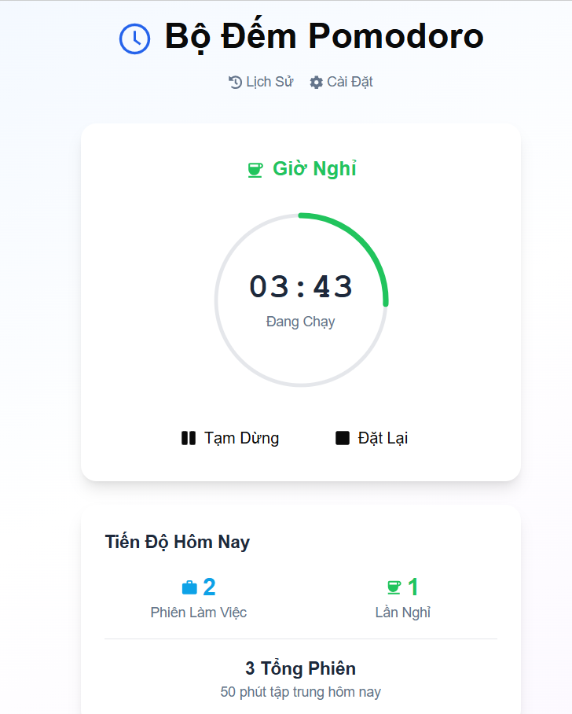
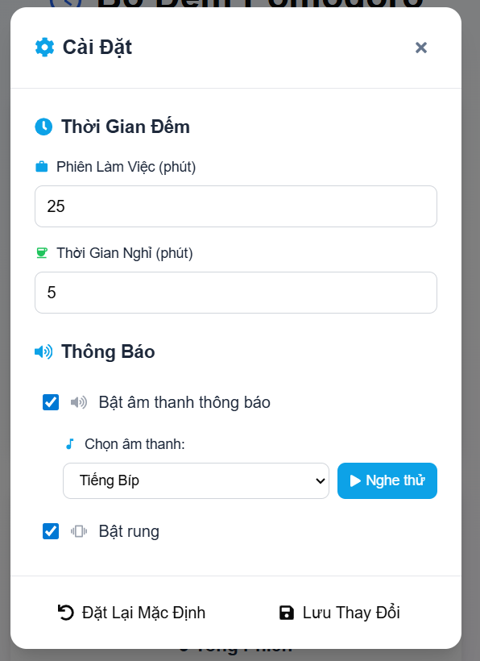
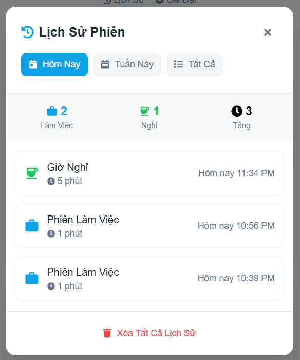

# 🍅 Pomodoro Timer App

Ứng dụng Pomodoro Timer được xây dựng với Next.js và Capacitor, hỗ trợ thông báo cục bộ đa nền tảng (Cross-platform Apps). Ứng dụng giúp bạn quản lý thời gian hiệu quả theo phương pháp Pomodoro với giao diện thân thiện và nhiều tính năng tùy chỉnh.

## Screenshots

### Màn hình chính - Phiên làm việc


### Màn hình chính - Giờ nghỉ


### Cài đặt


### Lịch sử phiên làm việc


## Tính năng chính

### Core Features
-  **Pomodoro Timer**: Đếm ngược thời gian với chu kỳ làm việc/nghỉ ngơi
-  **Session Management**: Quản lý phiên làm việc và nghỉ ngơi tự động
-  **Session History Tracking**: Tự động lưu lịch sử phiên làm việc với thời gian, ngày tháng và thống kê
-  **Cross-platform**: Chạy trên web, iOS và Android với Capacitor
-  **Local Notifications**: Thông báo cục bộ khi kết thúc phiên
-  **Custom Sounds**: 5 loại âm thanh thông báo có thể tùy chỉnh
-  **Haptic Feedback**: Phản hồi rung trên thiết bị di động


##  Công nghệ sử dụng

### Frontend Framework
- **Next.js 15.2.4** - React framework với SSR
- **React 19** - Library UI chính
- **TypeScript** - Type safety

### UI Libraries
- **Tailwind CSS 3.4.17** - CSS framework
- **Radix UI** - Accessible UI components
- **Class Variance Authority** - Component variants

##  Cài đặt và Chạy

### Prerequisites
- Node.js 18+ 
- npm hoặc pnpm
- Capacitor CLI (cho mobile development)

### 1. Clone Repository
```bash
git clone https://github.com/klitn/pomodoro-app.git
cd pomodoro-app
```

### 2. Cài đặt Dependencies
```bash
npm install
# hoặc
pnpm install
```

### 3. Chạy Development Server
```bash
npm run dev
# hoặc
pnpm dev
```

Mở [http://localhost:3000](http://localhost:3000) để xem ứng dụng.

### 4. Build cho Production
```bash
npm run build
npm start
```

##  Phát triển Mobile

### iOS Development
```bash
npx cap add ios
npx cap build ios
npx cap open ios
```

### Android Development
```bash
npx cap add android
npx cap build android
npx cap open android
```

### Sync sau khi thay đổi
```bash
npx cap sync
```

##  Cấu trúc Project

```
pomodoro-app/
├── src/
│   ├── components/
│   │   ├── PomodoroTimer.jsx    # Component timer chính
│   │   ├── Settings.jsx         # Cài đặt ứng dụng
│   │   └── SessionHistory.jsx   # Lịch sử phiên làm việc
│   └── services/
│       ├── timer.js            # Logic timer Pomodoro
│       ├── notifications.js    # Service thông báo
│       └── storage.js          # Local storage management
├── app/
│   ├── layout.tsx              # Layout chính Next.js
│   ├── page.tsx                # Trang chủ
│   └── globals.css             # Global styles
├── components/ui/              # UI components (Radix)
├── public/
│   ├── Screen/                 # Screenshots
│   └── sounds/                 # Audio files
└── capacitor.config.json       # Cấu hình Capacitor
```
